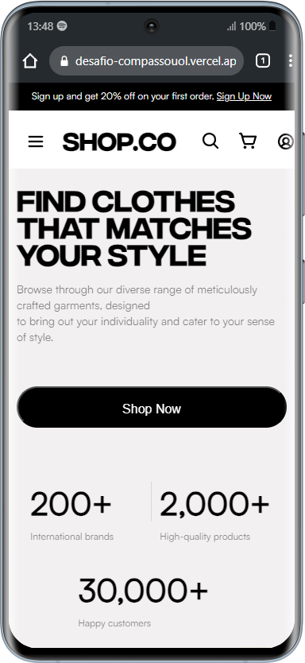
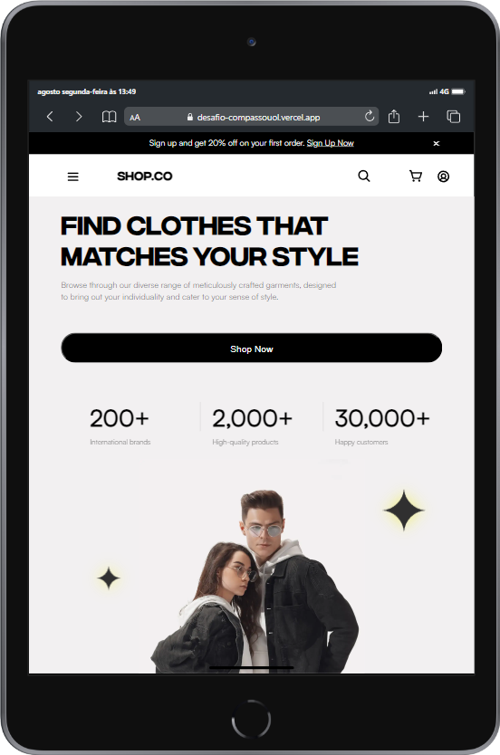

💻 Sobre o projeto
Projeto desenvolvido para conhecer melhor as habilidades técnicas reforçar as bases do desenvolvimento front-end, principalmente com HTML, CSS e Javascript.

Foi de grande valor ter essa experiência, desafios é desenvolver page de login e page home.

📺 Preview

 🚀 Como executar o projeto
Este projeto consiste em três partes:

Desenvolvimento do Frontend das telas
Design Responsivo
Implementação do Javascript para interações

🛠 Tecnologias
As seguintes ferramentas foram usadas na construção do projeto:

Front-end: HTML | CSS | JS

Utilitários
Editor: Visual Studio Code
Layout: Figma | CompassoUol
Fonts: Satoshi | IntegralCF

🚀 Site publicado

Feito por Paulo Oliveira 👋 Entre em contato 👨‍💻